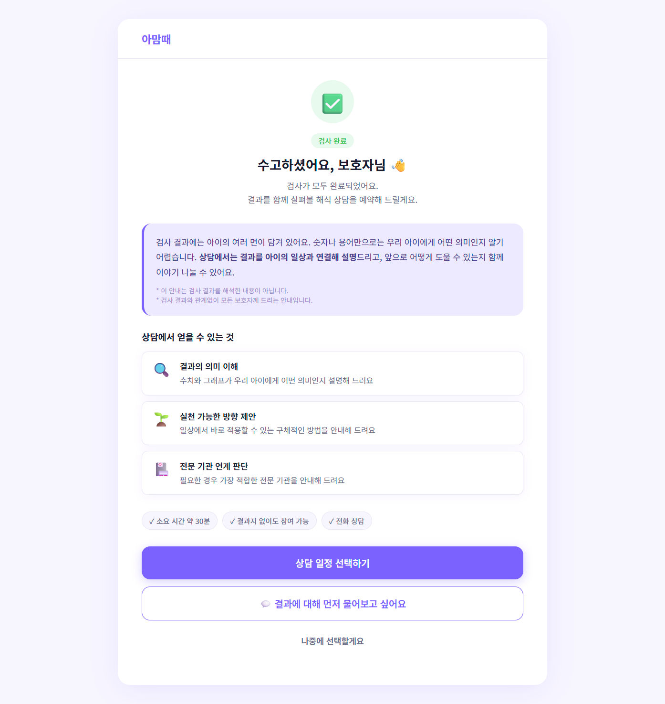
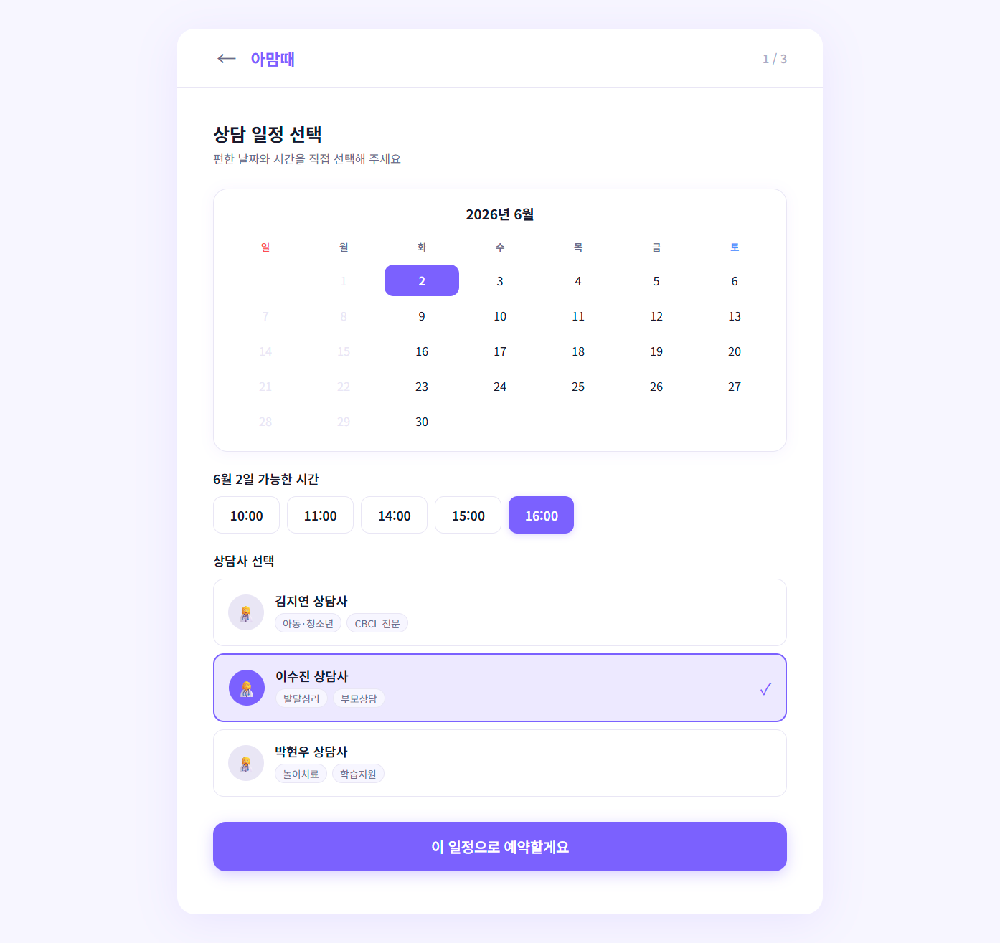
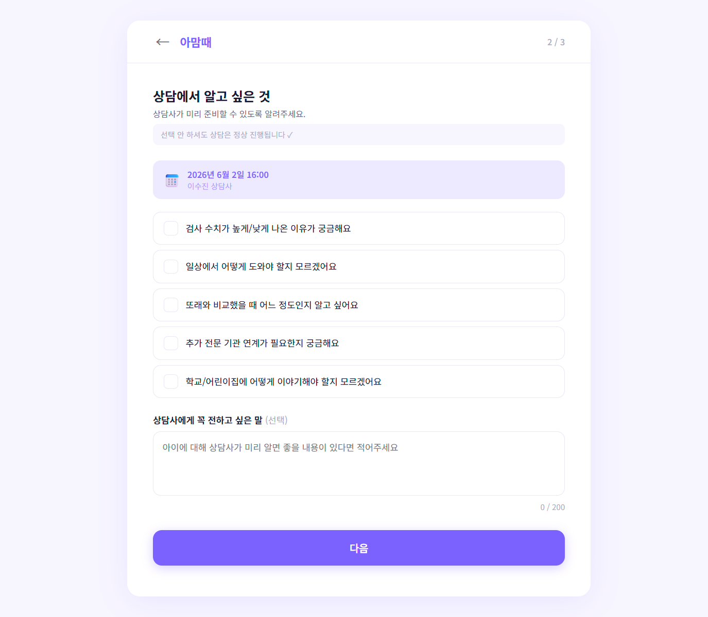
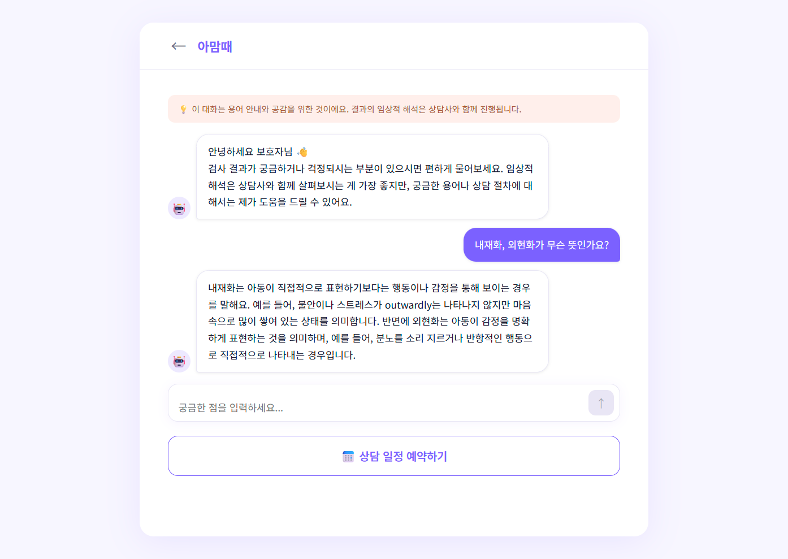
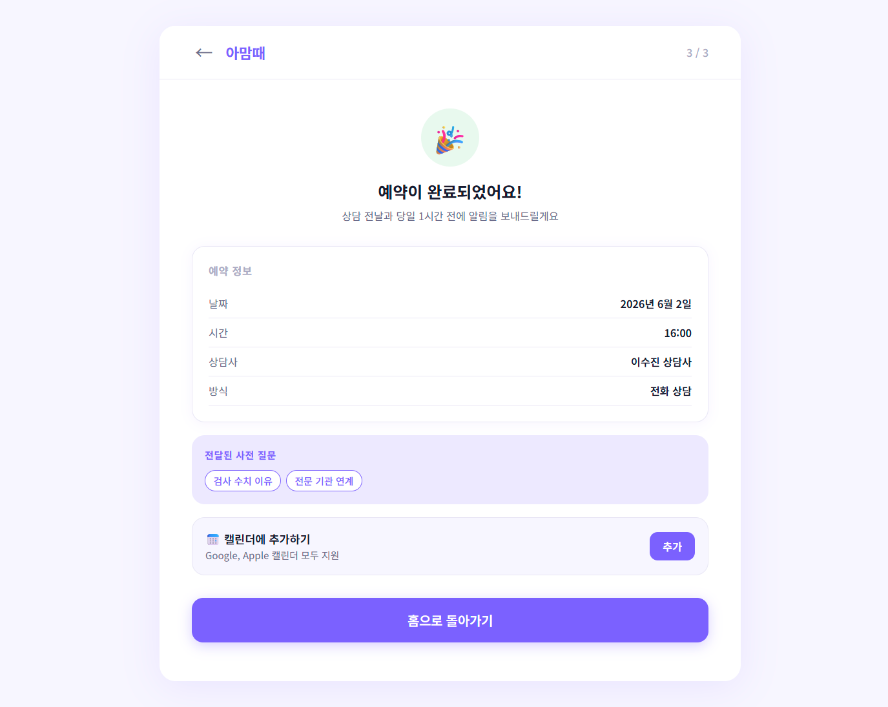
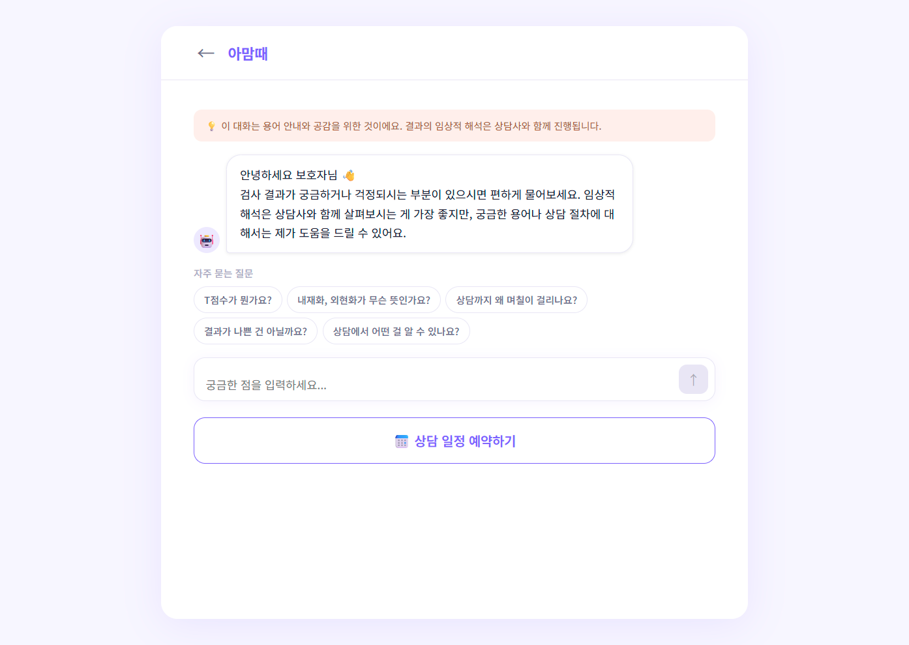

# 아맘때 Engage — 보호자 상담 예약 POC

> 아동 발달 심리 검사(CBCL) 완료 후 보호자의 불안을 완화하고 해석 상담 이탈을 방지하기 위한 AI 기반 웹 애플리케이션

---

## 목차

1. [스크린샷](#1스크린샷)
2. [데모 영상](#2데모-영상)
3. [배경 및 목적](#3배경-및-목적)
4. [주요 기능](#4주요-기능)
5. [기술 스택](#5기술-스택)
6. [프로젝트 구조](#6프로젝트-구조)
7. [실행방법](#7실행방법)
8. [사용 흐름](#8사용-흐름)
9. [AI 설계 원칙](#9ai-설계-원칙)
10. [성공 지표 (KPI)](#10성공-지표-kpi)
11. [개발 로드맵](#11개발-로드맵)
12. [보완이 필요한 사항](#12보완이-필요한-사항)
13. [라이선스](#13라이선스)

---

## 1.스크린샷

| 브리징 메시지 | 일정 선택 |
|:---:|:---:|
|  |  |
| 검사 완료 직후 상담의 가치를 안내하고 불안을 완화합니다 | 달력에서 날짜·시간·상담사를 직접 선택합니다 |

| 사전 질문 수집 | AI 채팅 |
|:---:|:---:|
|  |  |
| 상담사가 미리 준비할 수 있도록 관심사를 선택하고 전달합니다 | 대기 중 궁금한 용어나 절차를 AI와 실시간으로 대화합니다 |

| 예약 완료 | AI 채팅 (초기 화면) |
|:---:|:---:|
|  |  |
| 예약 정보를 확인하고 캘린더에 바로 추가할 수 있습니다 | 자주 묻는 질문으로 대화를 빠르게 시작할 수 있습니다 |

---

## 2.데모 영상

[](https://youtu.be/srBBJxiPVWc)

> 이미지를 클릭하면 전체 서비스 흐름을 확인할 수 있습니다 — 검사 완료 후 브리징 메시지, AI 채팅, 일정 선택, 예약 완료까지의 전체 플로우

---

## 3.배경 및 목적

아맘때 서비스는 AI 기반 비대면 발달심리 검사와 상담사 전화 상담을 제공합니다. 검사 완료 후 해석 상담까지 2~3일의 공백이 존재하며, 이 기간에 보호자는 임상 용어가 포함된 보고서를 혼자 읽으며 불안이 심화됩니다. 이는 상담 이탈, CS 문의 증가, 서비스 신뢰도 저하로 이어집니다.

**Engage**는 이 공백을 해소하기 위해 다음 세 가지를 제공합니다.

- 보호자가 주도적으로 상담 일정을 선택하는 구조 (No-show 최소화)
- 검사 용어와 불안에 대해 실시간으로 대화할 수 있는 AI 채팅
- 상담사가 상담 전 보호자의 관심사를 파악할 수 있는 사전 질문 수집

---

## 4.주요 기능

| 기능 | 설명 |
|------|------|
| 브리징 메시지 | 검사 완료 직후 상담의 가치를 안내, 불안 완화 |
| AI 채팅 | 로컬 LLM(exaone3.5:2.4b)을 통한 용어 설명·공감 대화. 임상 해석 없음 |
| 일정 선택 | 달력 UI에서 날짜·시간·상담사 직접 선택 |
| 사전 질문 수집 | 선택지 5개 + 자유 입력으로 상담사에게 사전 전달 |
| 캘린더 연동 | .ics 파일 다운로드로 Google·Apple 캘린더 추가 |
| 리마인더 플로우 | 미선택 시 3·6·12·24시간 후 재안내, 이후 CS 연결 |

---

## 5.기술 스택

| 구분 | 기술 |
|------|------|
| 프레임워크 | React 18 + Vite 5 |
| 라우팅 | React Router DOM 6 |
| AI 추론 | Ollama (로컬 LLM) — exaone3.5:2.4b |
| 스타일 | 인라인 스타일 + CSS 변수 (외부 UI 라이브러리 없음) |
| 반응형 | 모바일 / 태블릿 / 데스크탑 3단계 브레이크포인트 |

### AI 모델 선정

| 항목 | 내용 |
|------|------|
| 모델 | EXAONE 3.5 2.4B Instruct |
| 개발사 | LG AI Research |
| 파라미터 | 2.4B |
| 컨텍스트 길이 | 최대 32K 토큰 |
| 런타임 | Ollama (로컬 실행) |

**선정 이유:**

- **한국어 특화** — LG AI Research가 한국어에 최적화하여 개발한 모델로, 동급 크기 모델 중 한국어 응답 품질이 가장 높습니다.
- **경량 모델** — 2.4B 파라미터로 GPU 없이 CPU 환경에서도 실용적인 속도로 동작합니다. POC 환경에서 별도 서버 없이 바로 테스트가 가능합니다.
- **데이터 보안** — 로컬에서만 추론이 이루어지며 보호자의 입력 내용이 외부 서버로 전송되지 않습니다. 아동 심리 관련 민감 정보를 다루는 서비스 특성상 중요한 조건입니다.
- **임상 해석 제어 용이** — 시스템 프롬프트로 응답 범위를 명확히 제한할 수 있어, 임상 해석 금지 원칙을 안정적으로 적용할 수 있습니다.

**2차 개발 시 대안 모델:**

| 모델 | 특징 | 전환 시점 |
|------|------|---------|
| EXAONE 3.5 7.8B | 더 자연스러운 한국어, 높은 공감 품질 | GPU 환경 확보 시 |
| Qwen2.5 7B | 다국어 지원, 영문 보고서 대응 필요 시 | 서비스 글로벌 확장 시 |

---

## 6.프로젝트 구조

```
engage/
├── index.html
├── package.json
├── vite.config.js
├── docs/
│   ├── screenshots/               # 스크린샷 이미지
│   └── 아맘때 - 상담 예약 - Chrome 2026-06-02 13-15-23.mp4
└── src/
    ├── main.jsx
    ├── App.jsx
    ├── index.css                  # CSS 변수 및 전역 스타일
    ├── components/
    │   ├── Layout.jsx             # 공통 헤더·래퍼 (반응형)
    │   └── Btn.jsx                # 공통 버튼 컴포넌트
    └── pages/
        ├── BridgingPage.jsx       # 검사 완료 · 상담 안내
        ├── ChatPage.jsx           # AI 채팅 (Ollama 연동)
        ├── SchedulePage.jsx       # 달력 · 시간 · 상담사 선택
        ├── QuestionsPage.jsx      # 사전 질문 수집
        ├── ConfirmPage.jsx        # 예약 완료 · .ics 캘린더 연동
        └── ReminderPage.jsx       # 리마인더 시간 선택 · CS 연결
```

---

## 7.실행방법

### 사전 요구사항

- Node.js 18 이상
- [Ollama](https://ollama.com/download) 설치 및 실행

### 7.1. Ollama 모델 다운로드

```bash
ollama pull exaone3.5:2.4b
```

### 7.2. Ollama CORS 설정 (Windows PowerShell)

```powershell
[System.Environment]::SetEnvironmentVariable("OLLAMA_ORIGINS", "*", "User")
```

설정 후 작업표시줄 트레이에서 Ollama를 재시작합니다.

### 7.3. 의존성 설치 및 실행

```bash
npm install
npm run dev
```

브라우저에서 `http://localhost:5173` 접속

---

## 8.사용 흐름

```
검사 완료
    │
    ▼
브리징 메시지 (/)
    ├── AI 채팅 (/chat)          ← 궁금증·불안 해소
    ├── 일정 선택 (/schedule)    ← 날짜·시간·상담사 선택
    │       │
    │       ▼
    │   사전 질문 수집 (/questions)
    │       │
    │       ▼
    │   예약 완료 (/confirm)     ← .ics 캘린더 추가
    │
    └── 나중에 선택 (/reminder)  ← 리마인더 시간 선택 · CS 연결
```

---

## 9.AI 설계 원칙

- 임상적 해석, 진단, 판단을 절대 제공하지 않습니다
- 용어 설명(T점수, 내재화·외현화 등)과 공감 응답만 허용합니다
- 결과 해석 요청 시 "정확한 해석은 상담사와 함께 확인하시는 게 좋아요"로만 응답합니다
- 모든 데이터는 로컬에서만 처리되며 외부 서버로 전송되지 않습니다

---

## 10.성공 지표 (KPI)

| 지표 | 측정 방식 |
|------|---------|
| 상담 이탈률 | 검사 완료 후 미예약 비율 추적 |
| 일정 선택 완료율 | 브리징 메시지 노출 대비 예약 완료 수 |
| 캘린더 추가율 | 일정 확정자 중 캘린더 추가 클릭 비율 |
| 리마인더 전환율 | 리마인더 발송 후 24h 내 예약 완료 비율 |
| 사전 질문 수집률 | 예약 완료자 중 1개 이상 선택 비율 |

---

## 11.개발 로드맵

### POC (현재)
- [x] 브리징 메시지 + 일정 선택 UI
- [x] 로컬 LLM 기반 AI 채팅 (exaone3.5:2.4b)
- [x] 사전 질문 수집 폼
- [x] .ics 캘린더 연동
- [x] 리마인더 플로우 + CS 연결
- [x] 반응형 레이아웃

### 2차 개발
- [ ] 상담사 대시보드 (사전 질문 요약 뷰)
- [ ] Google Calendar API OAuth 연동
- [ ] 카카오 알림톡 / 문자 리마인더 발송
- [ ] 보호자 인증 및 검사 결과 연동
- [ ] LLM 동적 메시지 생성 (연령대별 맞춤)

---

## 12.보완이 필요한 사항

> POC 이후 본 개발 전 반드시 검토해야 할 항목

1. **개인정보 동의**: 사전 질문 수집 및 리마인더 발송 시 정보 활용 동의 절차 미구현
2. **상담사 시스템 연동**: 수집된 사전 질문이 실제 상담사에게 전달되는 파이프라인 없음
3. **실제 슬롯 연동**: 달력의 예약 가능 시간이 하드코딩되어 있음. 상담사 스케줄 API 연동 필요
4. **AI 응답 품질 검수**: 시스템 프롬프트 기반 제어이므로 엣지케이스(우회 질문 등) 추가 테스트 필요
5. **오류 처리**: Ollama 미실행 시 fallback UI 개선 필요

---

## 13.라이선스

Internal POC — (주)인사이터
